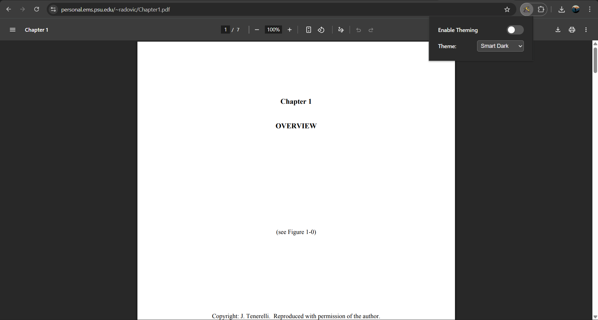
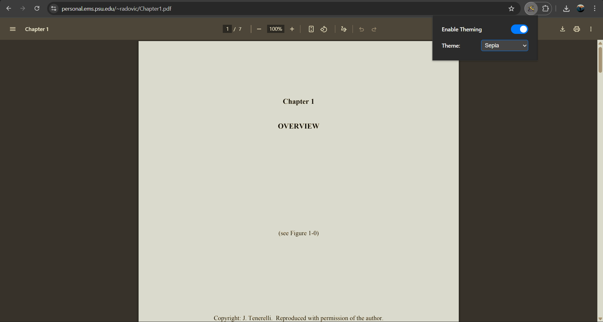
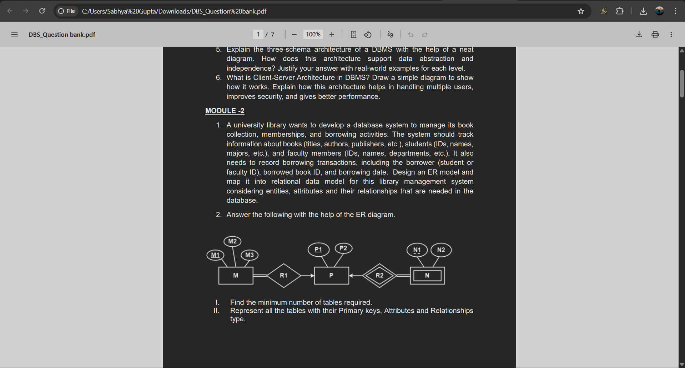
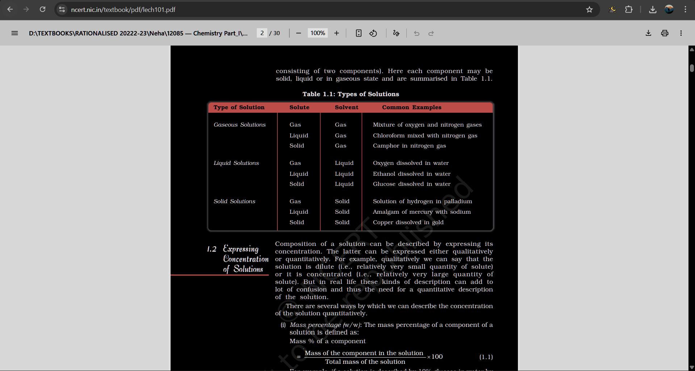

# Darken - PDF Dark Mode Reader

Soon Available in the Chrome Web Store!!

A sleek, lightweight Chrome extension that gives you complete control over your PDF viewing experience. With a single click, convert any PDF—whether it's on the web or a local file on your computer—into a beautiful, eye-friendly theme.

This project was built to solve the common problem of eye strain from bright white PDFs, especially when working or studying at night.

## 📸 Screenshots

<table align="center">
  <tr>
    <td align="center" width="50%">
      
    </td>
    <td align="center" width="50%">
      
    </td>
  </tr>
  <tr>
    <td align="center" width="50%">
      
    </td>
    <td align="center" width="50%">
      
    </td>
  </tr>
</table>

## ✨ Key Features

* **Works Everywhere:** Seamlessly applies themes to both online PDFs and **local PDF files** opened in Chrome.
* **Multiple Themes:** Go beyond simple dark mode. Choose from a curated list of 8 themes:
    * Smart Dark (Protects images)
    * Pure Invert (Classic dark mode)
    * Sepia
    * Desert
    * Water
    * Neodark
    * Cyberpunk
* **Simple & Clean UI:** A minimal, dark-themed popup menu gives you instant control.
* **One-Click Toggle:** Easily enable or disable all theming with a single switch.
* **Lightweight & Fast:** Does one job and does it perfectly, with zero impact on your browser's performance.

## 🚀 Installation

### 1. From the Chrome Web Store (Soon!!)

1.  Visit the extension's page: (Soon)
2.  Click "Add to Chrome".
3.  Enjoy!

### 2. Manual Installation (For Developers)

1.  Clone this repository or download it as a ZIP file.
2.  Open your Chrome browser and navigate to `chrome://extensions`.
3.  Enable **"Developer mode"** (using the toggle in the top-right corner).
4.  Click the **"Load unpacked"** button.
5.  Select the folder where you cloned or unzipped this repository.
6.  **IMPORTANT:** To make it work on local files, click the extension's "Details" button and turn **ON** the **"Allow access to file URLs"** toggle.

## 📖 How to Use

1.  Open any PDF document in a Chrome tab (either from a website or your local computer).
2.  Click the "Darken" icon in your Chrome toolbar.
3.  Use the main toggle to turn theming on or off.
4.  Select your desired theme from the dropdown menu.
5.  The changes will be applied instantly!

## 🔒 Privacy

This extension respects your privacy. It **does not collect, store, or transmit any personal data.**

The only information saved is your last-used settings (the chosen theme and the on/off state), which are stored locally on your own browser using the `chrome.storage` API.

## ⚖️ License

This project is licensed under the **MIT License**. See the [LICENSE](LICENSE) file for details.